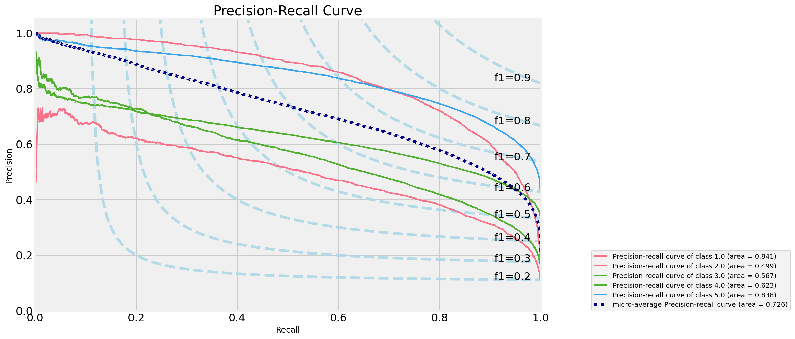

# Data Science Capstone Project - Hotel Review Score Predictor

This project was done as part of the General Assembly Data Science Immersive course taken April - June 2021

## Goals of the project

The goal of the project was to create a model that could analyze hotel review text and accurately predict the subsequent review score given by the reviewer. The project I thought would be interesting in that it brought together and enabled me to practice a few different aspects of the course I had taken up to that point including web scraping, classification modelling using NLP techniques and the chance to create a simple web app to demonstrate. The steps taken were as follows:

1. [Acquire Data](#Acquire-Data) - using web scraping techniques
2. [Data Cleaning](#Data-Cleaning,-EDA-and-Feature-Engineering) - Data cleaning, EDA and feature engineering
3. [Modelling](#Modelling) - Train and build range of classification models to create a review-score prediction model which performs considerably better than baseline on unseen test data
4. [Evaluation](#Evaluation) - Evaluate the performance of the model determining its limitations and room for further improvement
5. [Web App](#Web-App) - Create a simple web app to demonstrate model if possible ([web_app_link_here](https://hotel-review-predictor.herokuapp.com/home))
6. [Conclusions](#Conclusions)

## Acquire Data

I used BeautifulSoup and Requests Python libraries to scrape data from the TripAdvisor website. I decided to focus on London hotels only for the project to narrow down the scope to one city given the time-consuming nature of the web-scraping process. When you search for London Hotels on the website you are given a list of sorted hotels, each provides a link to the hotels main page with the hotel details/description and reviews at the bottom. Initially I scraped the links to all hotels in London (of which there were **1,923**) and selected details for each. Selected details for each hotel included:

* Hotel name and address
* Hotel description and "style"
* Hotel star rating
* Average review score
* Total num. reviews and their breakdown by language
* Extra details including range of room costs
* Details of hotel and location amenities

Of all the 1,923 hotels I discovered there were just over a million (1,072,222) reviews in total on the website. Each hotel page displayed only 5 reviews at a time and with the time given I realised I was not going to be able to scrape them all. I decided to focus initially on the "top chains" in London (Hilton, Marriott, Ibis, Premier Inn and TravelLodge) and only on English language reviews (over 80% of all reviews were in English). For each hotel review I was able to scrape the following data:

* Review headline
* Main body of review
* Date of stay of reviewer (MM/YYYY)
* Score (1-5)

I discovered after scraping only the "top chains" that I had relatively few reviews at the lower end of the spectrum (1 and 2 stars). I then decided to focus on scraping hotels where the average review was <= 3.0 in order to achieve a more balanced data set. After approx 2-3 weeks of solid scraping I managed to acquire a dataset of *283,624* reviews (just under 30% of the total).

All details of the web-scraping process can be found in the following notebook: [Web scraping_hotel_reviews](WebScrapingHotelReviews.ipynb)

## Data Cleaning, EDA and Feature Engineering

Details of the cleaning and EDA for the hotel data can be seen in the following notebook: [Hotels EDA](hotels_EDA.ipynb)

The data cleaning process for the hotel details data was fortunately not as laborious as I was originally expecting. A selection of the main steps taken included:

* Creation of number of reviews in English column
* New column with estimated time to scrape review data for each hotel
* Extraction and creation of average cost of a room column

Details of cleaning and EDA of the Review data can be found in the following notebook: [Modelling review data](Review_Modelling.ipynb)

The raw hotel review data was fortunately already in a relatively good shape and fortunately did not require a great deal of work. After removing any duplicated columns the summary of the process I took was:

* Conversion of Date of Stay of the reviewer to Datetime and thus was able to extract the year and month for EDA
* Added a length of review column as an added feature
* Combined review "title" and main body into 1 column in preparation for modelling.

### Features

Ultimately the data used for modelling was relatively simple. The final table looked as follows:

| Feature | Description | Type |
| ---- | ---- | ---- |
| review_score | Score given by the reviewer (range 1-5) | Int |
| review_title_body | Text of title and body of review | Str |
| review_length | number of characters in "review_title_body | int |

### The target

I will be predicting the reviewer's score so the target variable is **review_score**

## Modelling

Details of the modelling process can be seen in the following notebook: [Modelling review data](Review_Modelling.ipynb)

An overview of the steps can be seen below.

### Preparing the data

* Feature Selection

"review_title_body" was selected as the main feature and "review_length" was also used to see if it improved the accuracy score.

* Train-Test split

I applied an 80/20 train-test split to the data.

* Column Transformations

I applied a Count Vectorizer using stopwords from the NLTK library along with selected additional words which I added through experimentation. Further details of these can be seen in the notebook. Given the sheer size of the sparse matrix produced by this and with a mind on processing/modelling time I decided to limit the "max_features" parameter to 10,000 although I did do some experimentation with "ngram_range" and "max_features" as can be seen in the notebook.

Following the Count-Vectorizor the TFIDF Transformer was also experimented with.

The final model pipeline consisted of:

1. Count-Vectorizor
2. TF-IDF Transformer (optional)
3. Standard Scaler (optional - used for Logistic Regression if TF-IDF not used)
4. Classification model

### Fitting and scoring models

I ran a range of classification models on the training set with a 5-fold cross-validation gridsearch to test various parameters for each model. Unfortunately I was unable to run all the classification models I would have liked in the time given for the project given the size of the dataset and the incredibly time consuming nature of the grid-search process. Using the mean cross validated accuracy score for each model, a summary of the best models and parameters can be seen below:

| Model | features_used | Column_Transfer_Summary | Model_Params_Summary | Mean_CV_Score |
| ---- | ---- | ---- | ---- | ---- |
| Logistic_Regression | ['review_title_body'] | TF-IDF_Transformer | c=0.31622776601683794, solver='saga', class weight = 'balanced'  | 0.628483 |
| MultinomialNaiveBayes | ['review_title_body'] | | alpha = 0.001 | 0.613194 |
| RandomForest | ['review_title_body'] | TF-IDF_Transformer | max_depth=50 | 0.576927 |
| DecisionTreeClassifier| ['review_title_body', 'review_length] |  | max_depth=30  | 0.483156 |

## Evaluation

Examples of the best models and evaluation can be seen in the following notebook: [Modelling review data](Review_Modelling.ipynb)

The baseline prediction was 0.372318. We can see Proportion and number of each star review in the table image below:

| Rating | Number | Proportion_Total |
| ---- | ---- | ---- |
| 5 | 113,847 | 0.372318 |
| 4 | 97,743 | 0.319652 |
| 3 | 47,241 | 0.154494 |
| 2 | 22,024 | 0.072026 |
| 1 | 24,924 | 0.081510 |

The best model score achieved was using the Logistic Regression model with a mean CV score of 0.628258, which is a significant improvement on baseline. The confusion matrix, metrics and ROC curves from the test data for this model can be seen by expanding below:

 Confusion Matrix on test data for best model 

Precision-recall metrics:

| | precision | recall | f1-score | support |
| ---- | ---- | ---- | ---- | ---- |
| 1 | 0.71 | 0.78 | 0.75 | 4,931 |
| 2 | 0.44 | 0.61 | 0.51 | 4,376 |
| 3 | 0.54 | 0.57 | 0.56 | 9,404 |
| 4 | 0.63 | 0.57 | 0.60 | 19,451 |
| 5 | 0.77 | 0.75 | 0.76 | 22,691 |
||||||
| accuracy | | | 0.66 | 60,844 |
| macro avg | 0.62 | 0.66 | 0.63 | 60,844 |
| weighted avg | 0.66 | 0.66 | 0.66 | 60,844 |

 Precision-recall plot on test data for best model 

As can be seen from the metrics and precision_recall plots above, the model tended to predict the extreme scores (1 and 5) better than the intervening ones. I guess this is in some way a reflection on the fact we are all different individuals by nature in the way we each generally interpret and assign ratings which becomes more of a grey area as you move away from the extremes. The model finds it easier to pick up on more extreme words such as "excellent" and "terrible". Word count visualisations can be seen below for the different ratings to give a flavour into what sort of language constitutes each rating class. This gives a nice overall visualisation of each and you can clearly see the commonality of certain words across different ratings and gives an idea as to the difficulty the model will have in distinguishing between them.

<!--  

 ROC curves on test data for best model 

 -->

Please click on below to see word count visualisations:

 View word count visualisation - 5 star reviews 

 View word count visualisation - 4 star reviews 

 View word count visualisation - 3 star reviews 

 View word count visualisation - 2 star reviews 

 View word count visualisation - 1 star reviews 

### Limitations

* Different people have different value systems

As described above with the commonality of language across classes. Some people may be more lenient or harsh than others and tend perhaps towards giving different scores having essentially written very similar reviews.

* Reviews with contradictory language

I was interested in the more extreme cases where a review of 5 stars was given but the model predicted 1 or vice versa. I noticed that for a number of these they would refer to negative experiences that were eventually rectified for instance as well as references to previous positive experiences although the current one was negative. This will be a challenge for any model to pick up. A couple of examples of 1 star ratings but 5 star predictions can be seen by clicking on the examples below:

 

 contradictory_review_example_1 

 contradictory_review_example_2 

* Incorrect reviews/human error

Some people just simply put down scores that seem at odds with the review. An extreme example can be seen below where the reviewer put down 1 star but the model predicted 5. Please click below to view an example:

 

 suspected_reviewer_error 

I guess this is either an error or the reviewer has extremely high standards!!

* Time consuming nature of modelling a large data-set

Overall I think this was one of the biggest limitations of the project, especially with regards the time given to complete it. The initial data gathering/web scraping was very time consuming which didn't help with this matter. I was limited in terms of the number of different models I could test and the testing of various parameters for each via a grid_search. I'm convinced given more time I could achieve improved accuracy scores above 0.628. One of the biggest things I would have liked to have explored more was the n_grams parameter with max_features on the Count-Vectorizor, this may have helped with regards improving the models ability to better distinguish between contradictory reviews.

## Web App

I managed to create a simple web app using Flask which is a useful way of demonstrating the model. Here you can write a review and it will return the probability of the score you're likely to give. Please click on the link below to view and try for yourself. The web application code source folders can be viewed in the "flask" folder in the repository.

[web app](https://hotel-review-predictor.herokuapp.com/home)

## Conclusions

Overall, although this is a relatively simple concept, I think this has been an interesting and worthwhile project. I scraped over 300,000 reviews and data from a pool of over 1,900 hotels in London. I was able to do some reasonable EDA on this and using some NLP techniques managed to run a variety of classification models to reasonably categorize and predict the associated review score. I managed to successfully create a simple interactive web app to demonstrate the model. Further improvements and next steps would be:

* Introduce further features

I think it would have been useful to use some of the hotel data features such as the Hotel Star Rating or Average Room Cost in the modelling process. This may have helped improve scores, particularly regarding distinguishing between peoples values systems. People that are staying at an expensive 5 star hotel will probably have different expectations and "value" systems than those staying in one at the lower end of the scale. It would be interesting to explore this further.

* Further parameter exploration

As discussed above, there's certainly more parameters I would like to have explored not just in the models themselves but in the count vectorizer which would be interesting to explore further.

* Different Models/techniques

Similar to additional parameters there are further modelling techniques that would have been useful to investigate such as Support Vector Machines and Neural Networks as well as Boosting, Voting and Stacking techniques.

* Make use of cloud computing

In order to investigate further modelling and techniques and parameters more efficiently it would probably be necessary to make use of cloud computing services such as AWS to make use of greater computing power. I did try using some of the free tiers but these were inadequate for this dataset so an investment of money will probably be required to access the higher tiers.

* Work on Web App

My web app is relatively simple. It would be good to add some more functionality such as adding database functionality to create a record of users inputs and their results. It would be good to investigate Flask further and delve deeper into general web development.
